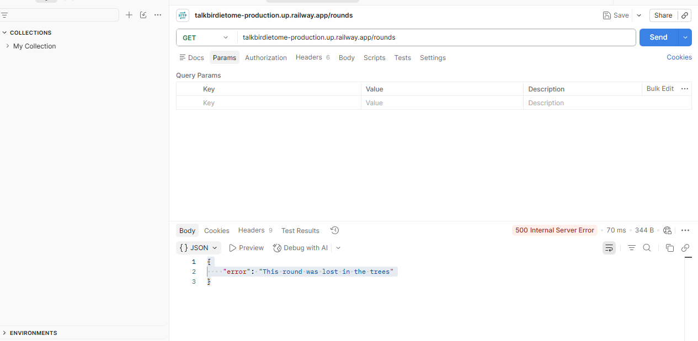
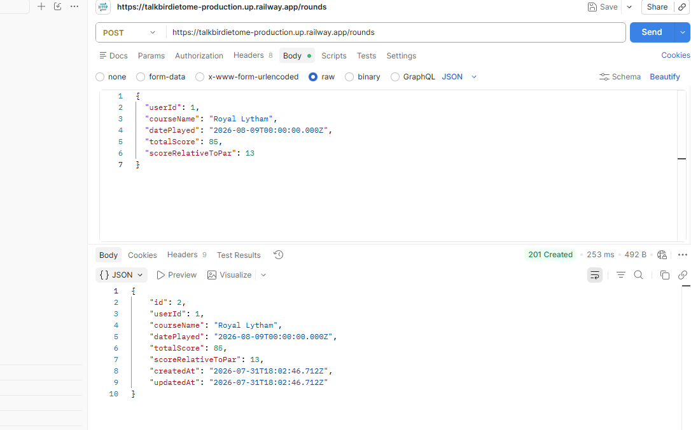
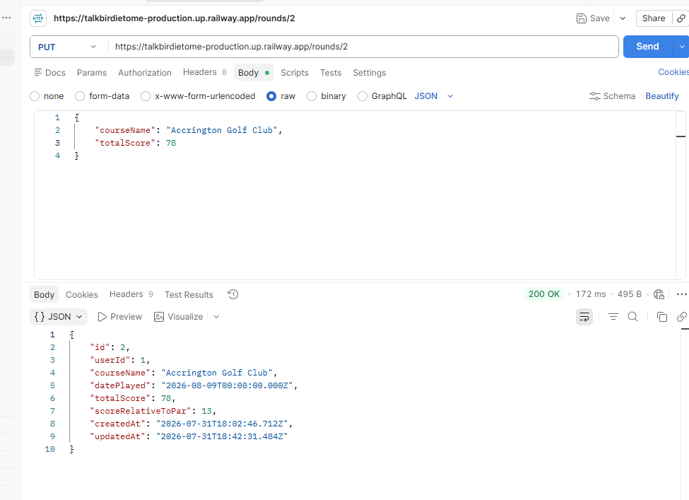
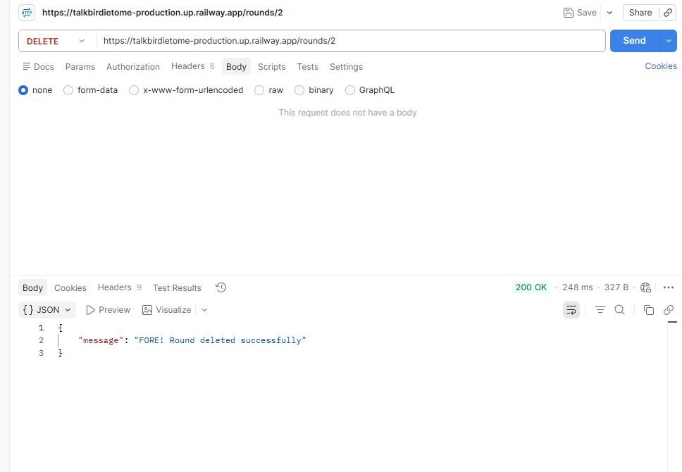
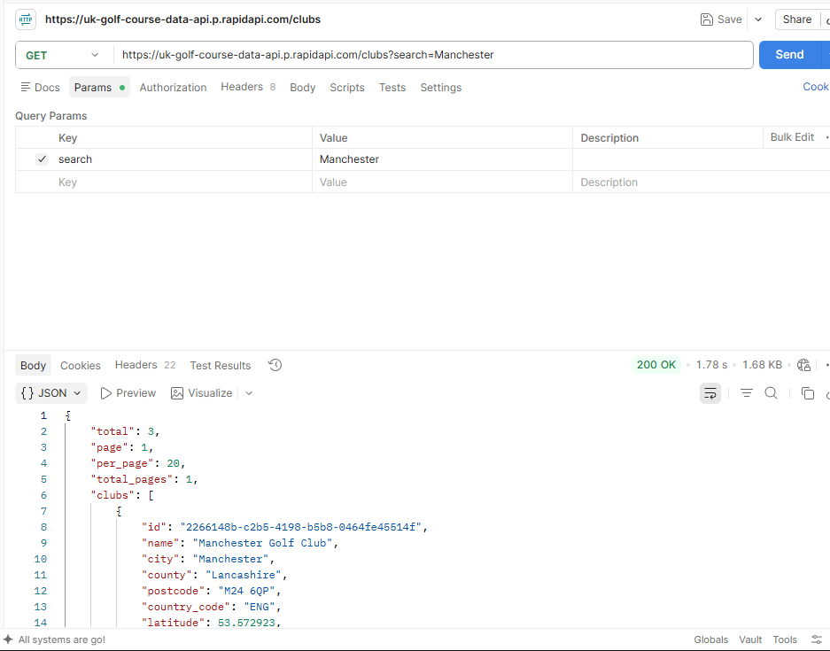
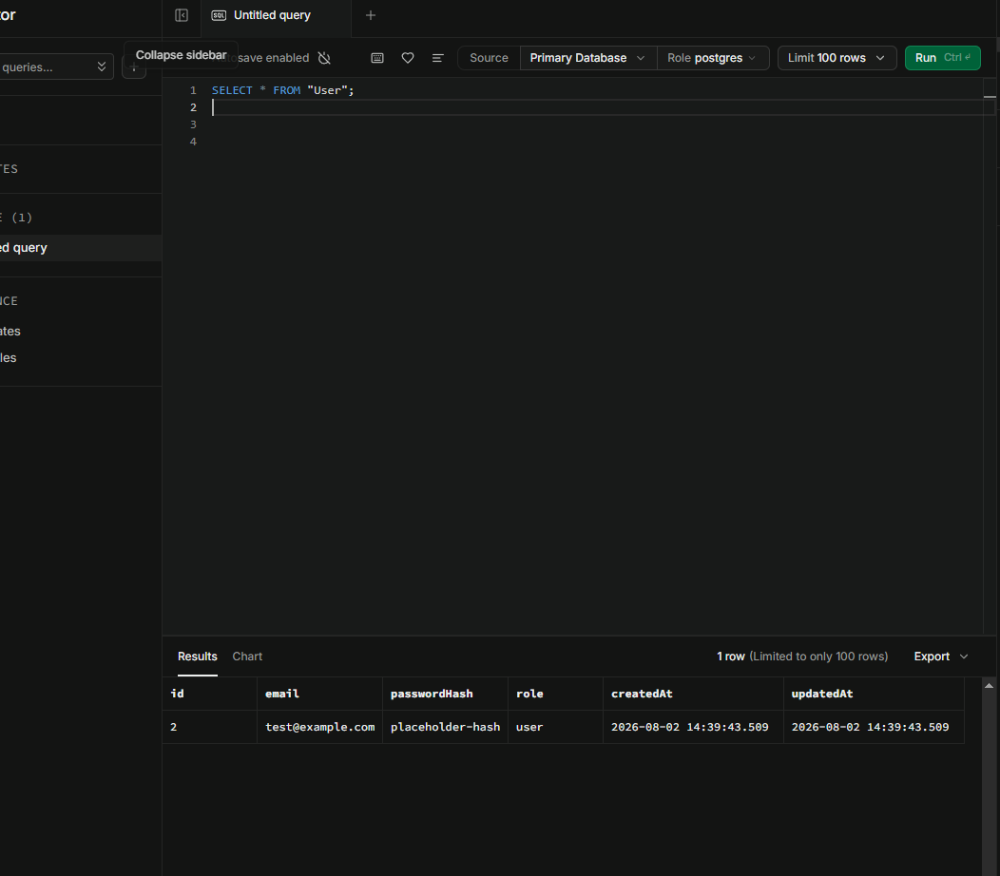
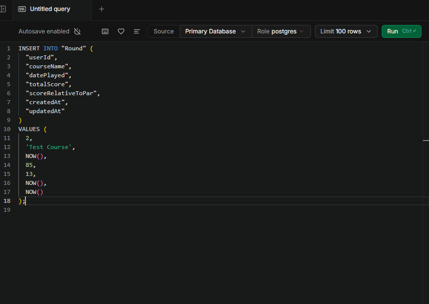
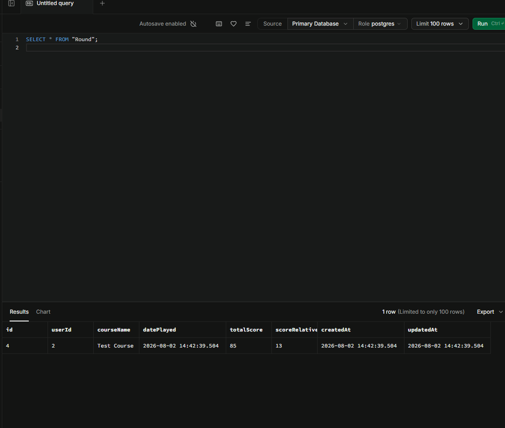

# Talk Birdie To Me

A full-stack Golf Scoring application built with Hapi.js, Prisma, Postgres and React.

## Week 1 goals

- Backend setup
- Hapi server running
- Prisma scheme created
- Hosted Postgres connected
- CRUD for Scorecard
- Backend deployed
- External API Chosen

Setup instructions coming soon.

## Initial API (POST/GET) Testing

To check the backend setup, I tested bot the GET & POST endpoints using Postman - 29.07.26

### GET /rounds

Confirms the API successfully read data from Supabase

### POST /rounds

Confirms a successful insert into the database with Prisma

## Initial API (DELETE/PUT) Testing

To check the backend setup, I tested DELETE & PUT endpoints using Postman - 30.07.26

### DELETE /rounds/{id}

Confirms round deleted

### PUT /rounds/{id}

Confirms the round was updated successfully

## Branch: feature/crud-complete

Initial CRUD work completed

## Testing

The project is using Jest to test service logic.
Because it's written using ES Modules, the tests use Jest's ESM compatible mocking (jest.unstable.mockModule) and dynamic imports to ensure mocks are applied before the service is loaded.

### Mocking Prisma

This is done to prevent real database calls:

### roundService.getAllRounds()

### Testing Notes

- Tests run using the node flag --experimental-vm-modules for Jest's ESM support
- This setup was implemented with the assistance of Co-Pilot to correctly configure ESM mocking and dynamic imports

The following service methods are fully tested:

- getAllRounds - Returns rounds
- createRound - Creates round
- updateRound - Updates round
- deleteRound - Deletes round

## Backend Deployment Status

The backend API is now deployed and reachable via HTTPS on Railway

Base URL - https://talkbirdietome-production.up.railway.app

### GET /rounds

Returns all ronds stored in the Database

### POST /rounds

Creates a new round

### PUT /rounds/{id}

Updates an existing round

### DELETE /rounds/{id}

Deletes a round

## Chosen API

### UK Golf Course Data API

### Successful response example

The request returned a list of matching clubs, including:

- Club ID
- Club name
- Address
- Region
- Country
- Associated courses

### Why this API?

- Covers 2,600+ UK golf clubs
- Provides hole data (par, yardage, stroke index)
- Supports search by location or course name
- Free tier sufficient for development

## Database Migration verification

After running Prisma migrations, the database schema was verified using SQL Editor in Supabase.
These checks confirm that the "User" and "Round" tables were created correctly and that the foreign key relationship between them is functioning as expected.

Test user was inserted into the database and returned when using a SELECT query:

A test round was then inserted against the user ID of the test user:

I then verified the test round by searching from "Round" to check that the test round was stored correctly and can be retrieved:

## Week 2 - User Registration & Authentication

For this project, I have decided to use Google Authentication through Supabase, instead of building a full manual registration and authentication. As a junior developer building a live app, I wanted something secure, reliable and quick to integrate without adding unnecessary complexity.

- Easy to set up
  As Google auth works straight out of the box, that alleviates time working on login logic, hashing or session handling. Supabase handles all of that.

- Security
  Because I'm not storing passwords myself, I avoid some security risks. Supabase handles the tokens and user sessions.

- User experience
  Most people use Google already, so logging in will become fast and familiar, as well as making the app feel more polished.

### Summary

I chose Google Auth because it's secure, simple and perfect for getting a live app up and running quickly. It removes a lot of the complexity and lets me focus on building the core functionality of the project.

## Authorisation & Ownership

### Role based access (RBAC)

Every user in the system has a role:

- user - Standard access
- admin - Full access

I added a requireRole middleware so certain routes could be restricted to certain users. As an example, admin only routes now require the user role to be admin before the request allows them to continue, otherwise it will show an error 403. This keeps privileged actions protected.

### Ownership checks

It's important that normal users have the ability to update or delete their own rounds. To enforce this, I added two small middleware functions:

- loadRound - Retrieves the round from the database
- checkOwnership - Compares the logged in user to the round's owner

Admins can bypass this check, but normal users must match the round owner. This will stop other users from modifying data they shouldn't be able to.

### Authorisation flow diagram

This diagram shows a journey of a request after a user logs in. Supabase proves who the user is, the backend checks what they're allowed to do, and ownership rules make sure users can only change their own data.

<pre>
┌──────────────────────────┐
│      Google OAuth        │
│  (User logs in via GCP)  │
└──────────────┬───────────┘
               ↓
┌──────────────────────────┐
│       Supabase Auth      │
│ Issues JWT containing:   │
│  - userId                │
│  - email                 │
│  - role (user/admin)     │
└──────────────┬───────────┘
               ↓
┌──────────────────────────┐
│  verifySupabaseToken     │
│  - Validates JWT         │
│  - Attaches auth info    │
└──────────────┬───────────┘
               ↓
┌──────────────────────────┐
│      requireRole         │
│  - Admin-only routes     │
│  - User-only routes      │
└──────────────┬───────────┘
               ↓
┌──────────────────────────┐
│       loadRound          │
│  - Fetch round by ID     │
│  - Attach to request     │
└──────────────┬───────────┘
               ↓
┌──────────────────────────┐
│     checkOwnership       │
│  - User must own round   │
│  - Admin bypasses        │
└──────────────┬───────────┘
               ↓
┌──────────────────────────┐
│       Controller         │
│  - Update/Delete round   │
└──────────────────────────┘
</pre>

