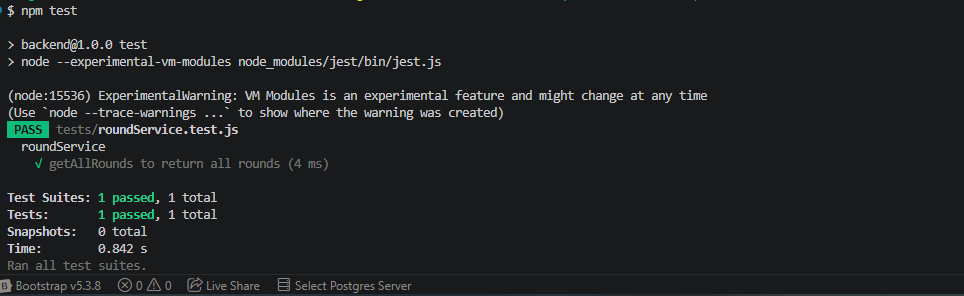

# Talk Birdie To Me

A full-stack Golf Scoring application built with Hapi.js, Prisma, Postgres and React.

## Week 1 goals

- Backend setup
- Hapi server running
- Prisma scheme created
- Hosted Postgres connected
- CRUD for Scorecard
- Backend deployed
- External API Chosen

Setup instructions coming soon.

## Initial API (POST/GET) Testing

To check the backend setup, I tested bot the GET & POST endpoints using Postman - 29.07.26

### GET /rounds

Confirms the API successfully read data from Supabase

### POST /rounds

Confirms a successful insert into the database with Prisma

## Initial API (DELETE/PUT) Testing

To check the backend setup, I tested DELETE & PUT endpoints using Postman - 30.07.26

### DELETE /rounds/{id}

Confirms round deleted

### PUT /rounds/{id}

Confirms the round was updated successfully

## Branch: feature/crud-complete

Initial CRUD work completed

## Testing

The project is using Jest to test service logic.
Because it's written using ES Modules, the tests use Jest's ESM compatible mocking (jest.unstable.mockModule) and dynamic imports to ensure mocks are applied before the service is loaded.

### Mocking Prisma

This is done to prevent real database calls:

### roundService.getAllRounds()

### Testing Notes

- Tests run using the node flag --experimental-vm-modules for Jest's ESM support
- This setup was implemented with the assistance of Co-Pilot to correctly configure ESM mocking and dynamic imports
