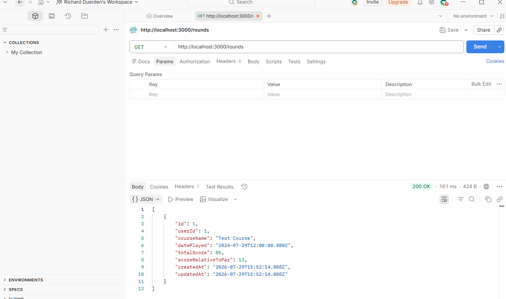
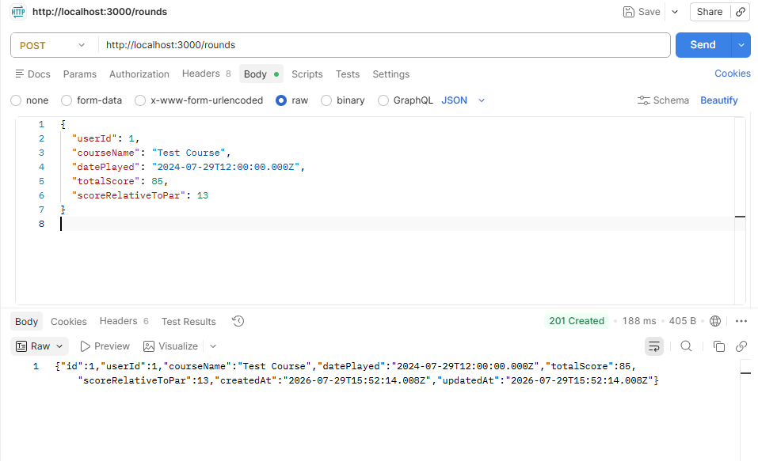
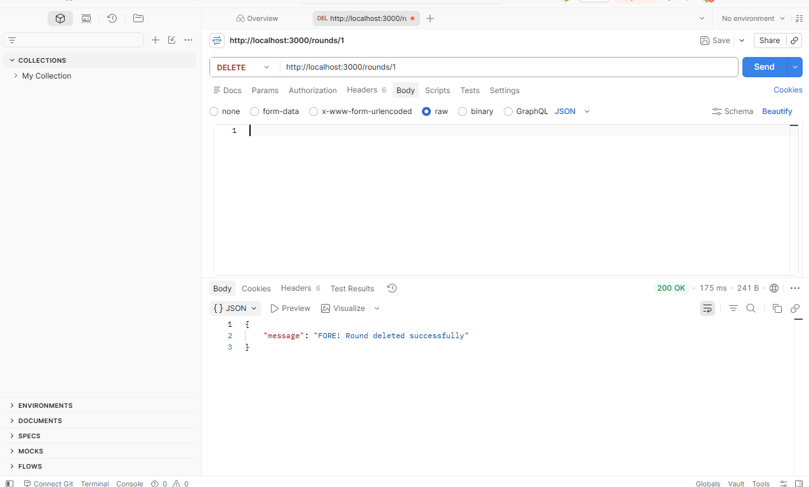
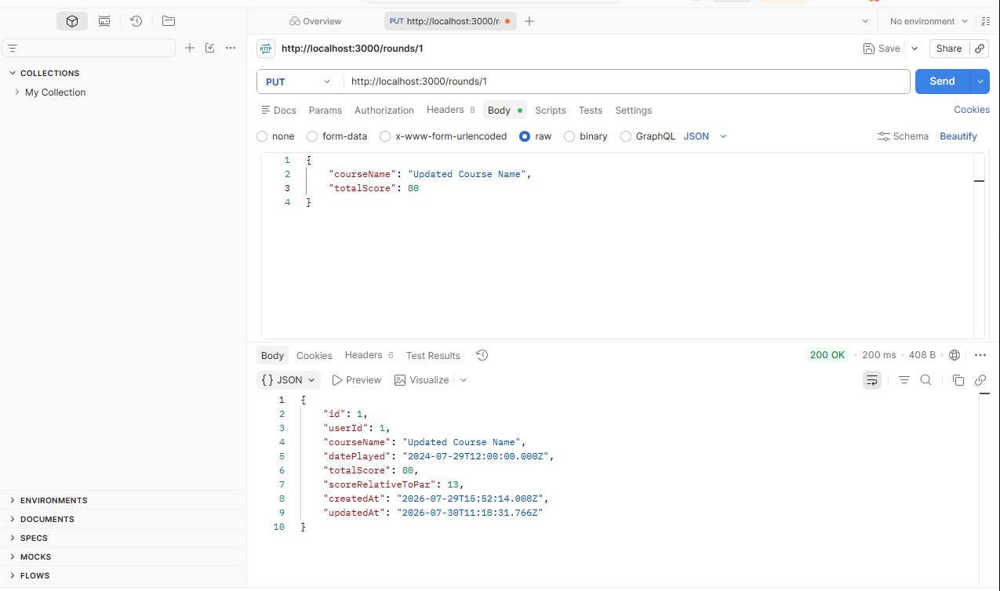

# Talk Birdie To Me

A full-stack Golf Scoring application built with Hapi.js, Prisma, Postgres and React.

## Week 1 goals

- Backend setup
- Hapi server running
- Prisma scheme created
- Hosted Postgres connected
- CRUD for Scorecard
- Backend deployed
- External API Chosen

Setup instructions coming soon.

## Initial API (POST/GET) Testing

To check the backend setup, I tested bot the GET & POST endpoints using Postman - 29.07.26

### GET /rounds

Confirms the API successfully read data from Supabase

### POST /rounds

Confirms a successful insert into the database with Prisma

## Initial API (DELETE/PUT) Testing

To check the backend setup, I tested DELETE & PUT endpoints using Postman - 30.07.26

### DELETE /rounds/{id}

Confirms round deleted

### PUT /rounds/{id}

Confirms the round was updated successfully

