# Talk Birdie To Me

A full-stack Golf Scoring application built with Hapi.js, Prisma, Postgres and React.

## Week 1 goals

- Backend setup
- Hapi server running
- Prisma scheme created
- Hosted Postgres connected
- CRUD for Scorecard
- Backend deployed
- External API Chosen

Setup instructions coming soon.

## Initial API (POST/GET) Testing

To check the backend setup, I tested bot the GET & POST endpoints using Postman - 29.07.26

### GET /rounds

Confirms the API successfully read data from Supabase

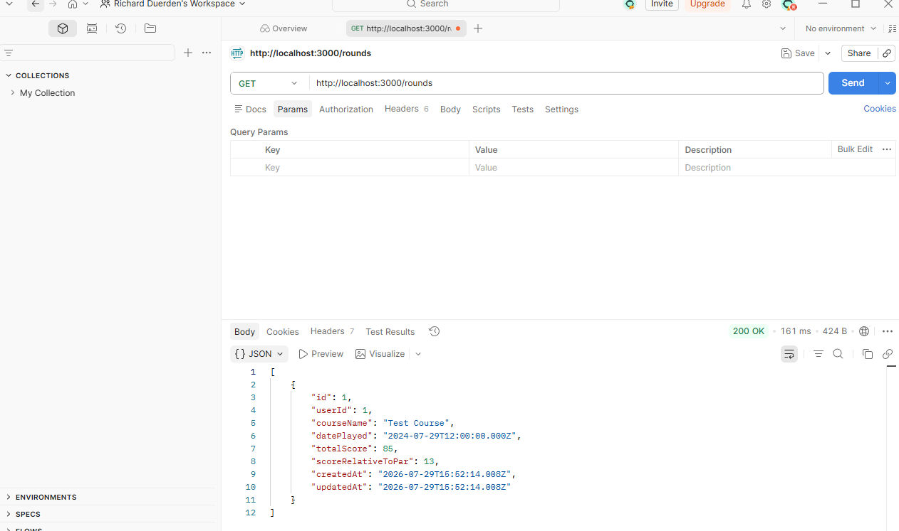

### POST /rounds

Confirms a successful insert into the database with Prisma

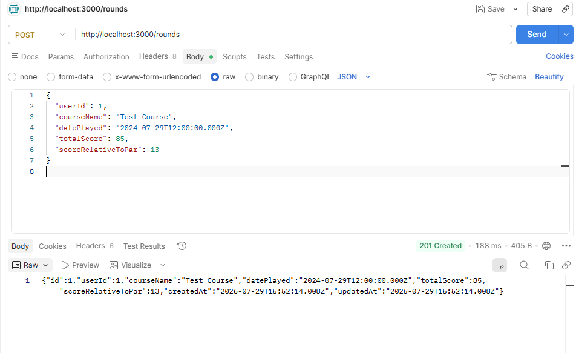

## Initial API (DELETE/PUT) Testing

To check the backend setup, I tested DELETE & PUT endpoints using Postman - 30.07.26

### DELETE /rounds/{id}

Confirms round deleted

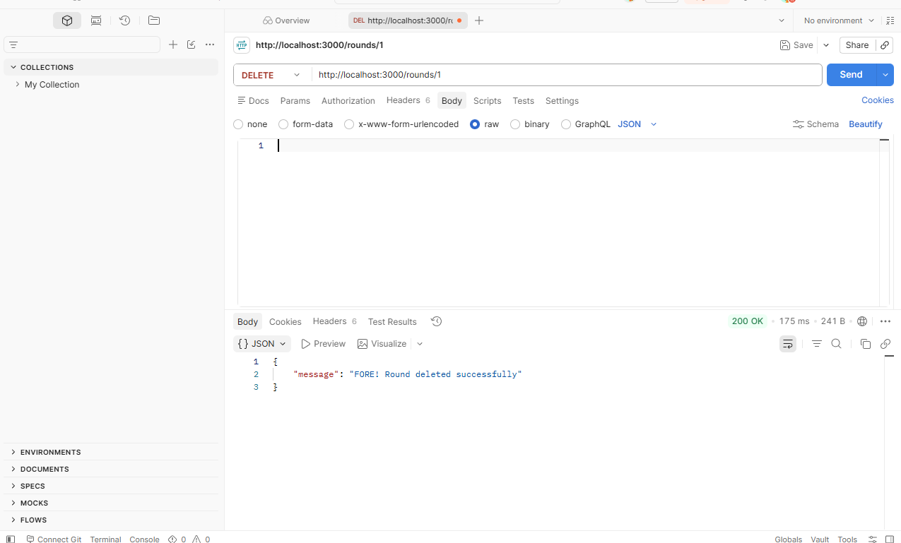

### PUT /rounds/{id}

Confirms the round was updated successfully

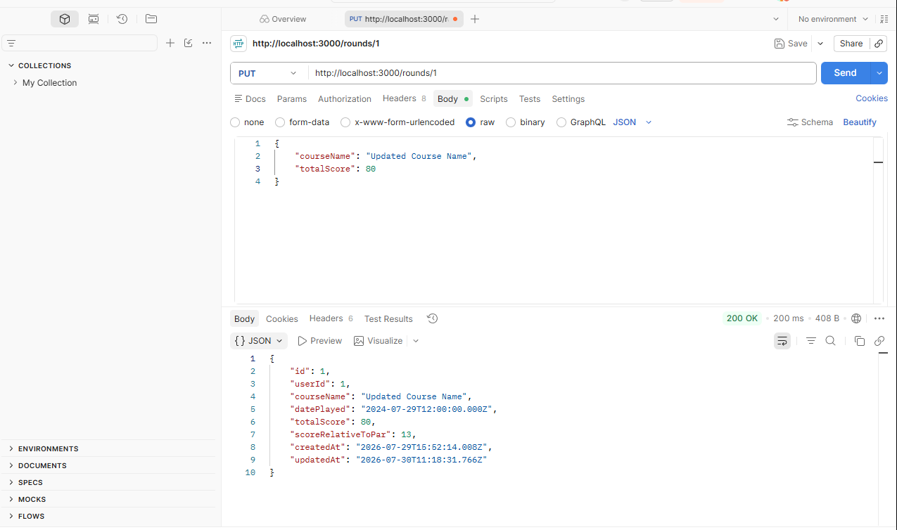

## Branch: feature/crud-complete

Initial CRUD work completed

## Testing

The project is using Jest to test service logic.
Because it's written using ES Modules, the tests use Jest's ESM compatible mocking (jest.unstable.mockModule) and dynamic imports to ensure mocks are applied before the service is loaded.

### Mocking Prisma

This is done to prevent real database calls:

### roundService.getAllRounds()

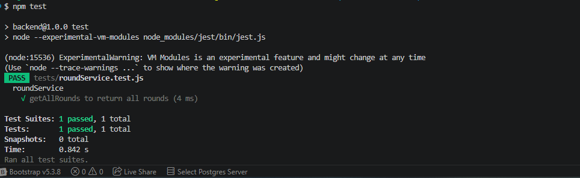

### Testing Notes

- Tests run using the node flag --experimental-vm-modules for Jest's ESM support
- This setup was implemented with the assistance of Co-Pilot to correctly configure ESM mocking and dynamic imports

The following service methods are fully tested:

- getAllRounds - Returns rounds
- createRound - Creates round
- updateRound - Updates round
- deleteRound - Deletes round

## Backend Deployment Status

The backend API is now deployed and reachable via HTTPS on Railway

Base URL - https://talkbirdietome-production.up.railway.app

### GET /rounds

Returns all ronds stored in the Database

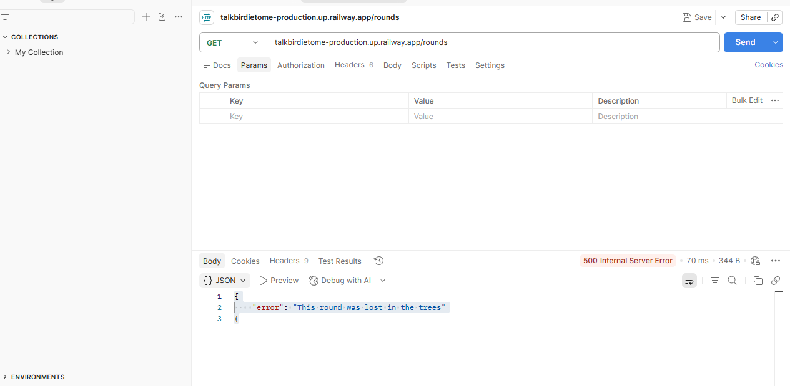

### POST /rounds

Creates a new round

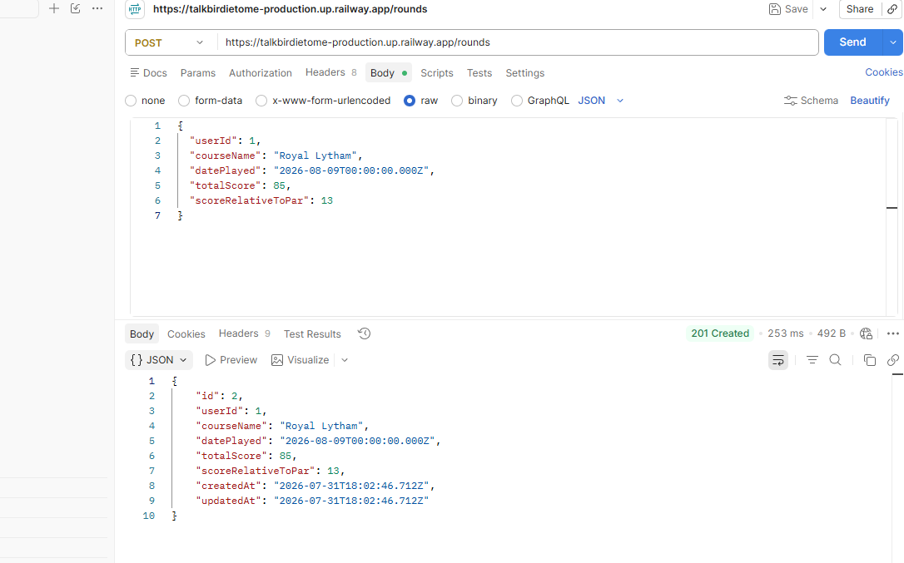

### PUT /rounds/{id}

Updates an existing round

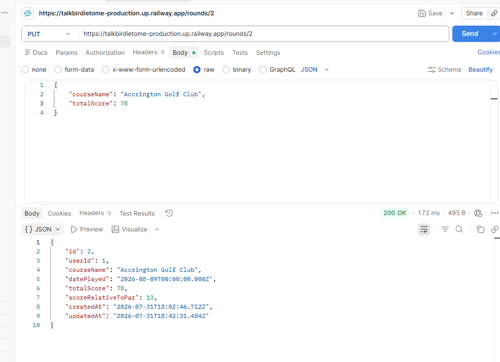

### DELETE /rounds/{id}

Deletes a round

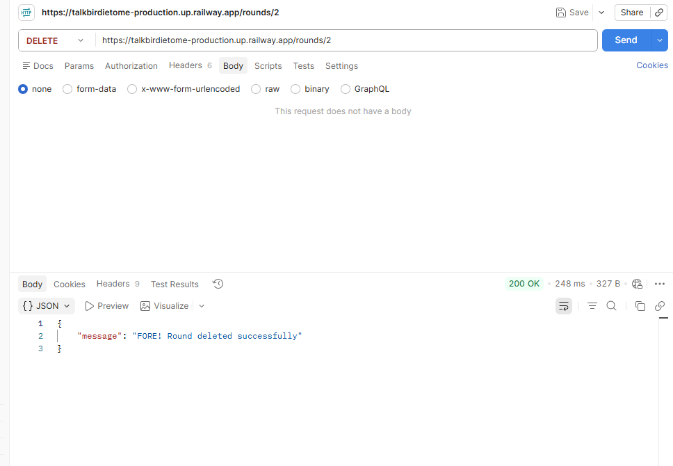

## Chosen API

### UK Golf Course Data API

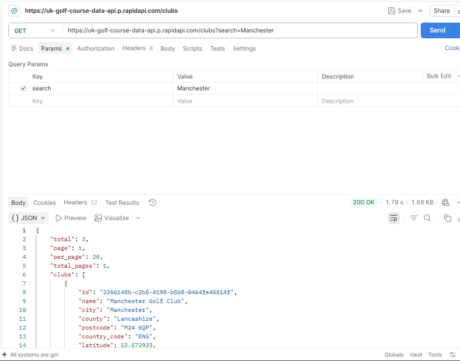

### Successful response example

The request returned a list of matching clubs, including:

- Club ID
- Club name
- Address
- Region
- Country
- Associated courses

### Why this API?

- Covers 2,600+ UK golf clubs
- Provides hole data (par, yardage, stroke index)
- Supports search by location or course name
- Free tier sufficient for development

## Database Migration verification

After running Prisma migrations, the database schema was verified using SQL Editor in Supabase.
These checks confirm that the "User" and "Round" tables were created correctly and that the foreign key relationship between them is functioning as expected.

Test user was inserted into the database and returned when using a SELECT query:

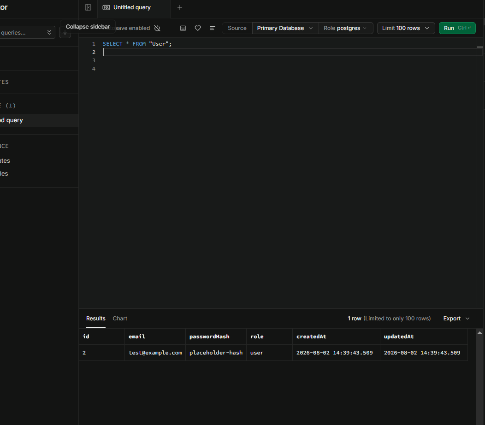

A test round was then inserted against the user ID of the test user:

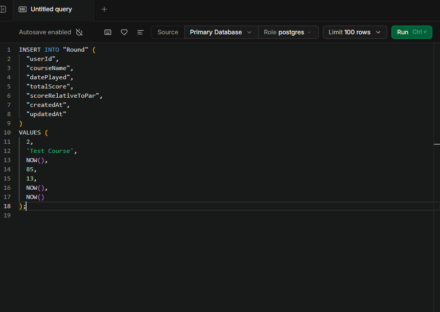

I then verified the test round by searching from "Round" to check that the test round was stored correctly and can be retrieved:

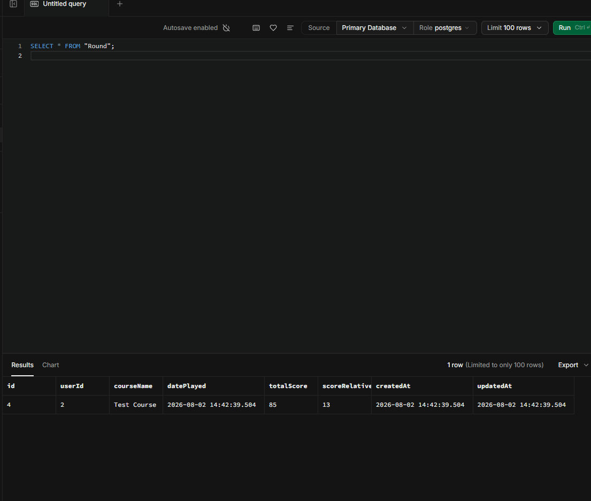

## Week 2 - User Registration & Authentication

For this project, I have decided to use Google Authentication through Supabase, instead of building a full manual registration and authentication. As a junior developer building a live app, I wanted something secure, reliable and quick to integrate without adding unnecessary complexity.

- Easy to set up
  As Google auth works straight out of the box, that alleviates time working on login logic, hashing or session handling. Supabase handles all of that.

- Security
  Because I'm not storing passwords myself, I avoid some security risks. Supabase handles the tokens and user sessions.

- User experience
  Most people use Google already, so logging in will become fast and familiar, as well as making the app feel more polished.

### Summary

I chose Google Auth because it's secure, simple and perfect for getting a live app up and running quickly. It removes a lot of the complexity and lets me focus on building the core functionality of the project.

## Authorisation & Ownership

### Role based access (RBAC)

Every user in the system has a role:

- user - Standard access
- admin - Full access

I added a requireRole middleware so certain routes could be restricted to certain users. As an example, admin only routes now require the user role to be admin before the request allows them to continue, otherwise it will show an error 403. This keeps privileged actions protected.

### Ownership checks

It's important that normal users have the ability to update or delete their own rounds. To enforce this, I added two small middleware functions:

- loadRound - Retrieves the round from the database
- checkOwnership - Compares the logged in user to the round's owner

Admins can bypass this check, but normal users must match the round owner. This will stop other users from modifying data they shouldn't be able to.

### Authorisation flow diagram

This diagram shows a journey of a request after a user logs in. Supabase proves who the user is, the backend checks what they're allowed to do, and ownership rules make sure users can only change their own data.

<pre>
┌──────────────────────────┐
│      Google OAuth        │
│  (User logs in via GCP)  │
└──────────────┬───────────┘
               ↓
┌──────────────────────────┐
│       Supabase Auth      │
│ Issues JWT containing:   │
│  - userId                │
│  - email                 │
│  - role (user/admin)     │
└──────────────┬───────────┘
               ↓
┌──────────────────────────┐
│  verifySupabaseToken     │
│  - Validates JWT         │
│  - Attaches auth info    │
└──────────────┬───────────┘
               ↓
┌──────────────────────────┐
│      requireRole         │
│  - Admin-only routes     │
│  - User-only routes      │
└──────────────┬───────────┘
               ↓
┌──────────────────────────┐
│       loadRound          │
│  - Fetch round by ID     │
│  - Attach to request     │
└──────────────┬───────────┘
               ↓
┌──────────────────────────┐
│     checkOwnership       │
│  - User must own round   │
│  - Admin bypasses        │
└──────────────┬───────────┘
               ↓
┌──────────────────────────┐
│       Controller         │
│  - Update/Delete round   │
└──────────────────────────┘
</pre>

## Security Test suite

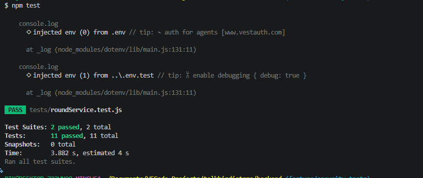

## Postman API Test Suite

To make backend testing fast, repeatable and consistent, this project includes a full Postman test suite covering:

- Authentication
- Authorisation
- Role based access control
- Protected routes
- Admin only endpoints

All collections are stored in the root level /postman directory.

### Importing the Collection

1. Open Postman
2. Click import
3. Select the file: /postman/TalkBirdieToMe API.postman_collection.json

The full week 2 auth suite will appear in your Collections panel

### Environment Setup

The collection uses Postman env variables for cleaner requests:

1. Click the Environments tab
2. Create a new environment
3. Add:
    - baseURL: http://localhost:8080
    - userToken = A generated user JWT
    - adminToken = A generated admin JWT

### Runing the Tests

Each request includes an automated Postman test to validate:

- Missing token → 401 Unauthorized
- Invalid token → 401 Unauthorized
- Valid user token → 200 OK
- User forbidden → 403 Forbidden
- Admin allowed → 200 OK

To run the entire suite:

1. Open the collection
2. Click Run Collection
3. Select your environment
4. Click Start Run

You’ll get a full pass/fail report for all authentication and authorization scenarios.

## Backend Refactor: Scorecard & Course Layout

Initially this app was a very basic Score keeper, that I was going to import live data from an API for the course information. Upon further review, this was very limiting - Only allowing 5 requests per minute, and 200 per month.

I ultimately decided to refactor the backend code, and utilise GolfAPI data to seed 14,000 courses across the united states as there is no available and free data for UK Courses.

## Why I Upgraded the Data Models & Database

### Fixing the Database Structure

At first, my app only had two main tables: `User` and `Round`. This was fine for typing in a quick total score, but it wasn't a real golf app. I wanted users to be able to search for a real course, pick their tee color (like White or Red), and see a real scorecard automatically filled out with the right Par, Yardage, and Hole Numbers.

To make that happen, I upgraded the database to follow the real world of golf:

- **Club:** Saves the golf club name and state location so users can search for it.
- **Course:** Handles different courses inside the same club.
- **Tee:** Lets users choose which color tees they are playing from (Blue, White, Red).
- **Hole:** Stores the layout for every single hole (Hole 1, Par 4, 387 Yards).
- **HoleScore:** This is the new table that saves the actual scores the user shoots on each hole.

### Making the Database Seeding 180x Faster

I found a database file with over 14,000 real golf clubs. At first, my code was trying to save these clubs one by one, line by line. This forced the code to make over 64,000 separate connections to PostgreSQL! It took over 3 hours to get through part of the file and was constantly risking crashing my machine.

I fixed this by changing the seed script to use **Batch Processing**. Instead of saving clubs one by one, the script now bundles them into groups of 1,000 in computer memory and saves them all at the exact same time using Prisma's `createMany` tool. Because of this, it now loops through all 14,023 courses and inserts **over 370,000 individual holes in just 66.1 seconds** without a single error.

### Other Code Fixes Made Along the Way

1. **Smarter Round Saving:** Updated my service files so that starting a round and logging individual hole scores happen safely together. If something breaks on one hole, the app safely stops the whole save so we don't get corrupted data.
2. **Auto-Complete Search:** Created a brand new course search route. Now, when a user types into the search bar, it looks at both club names and states using case-insensitive matching to find courses instantly.
3. **Automatic Math Calculations:** Moved the score calculations to the backend server. The app now adds up total strokes and score-relative-to-par automatically, saving my frontend from doing heavy math.
4. **The Hidden "String vs. Number" Permission Bug:** My security middleware was locking me out with a 403 error. This happened because Supabase auth tokens save user IDs as text strings (`"1"`), but my PostgreSQL database saves user IDs as real numbers (`1`). Because a string is not strictly equal to a number in JavaScript, the app thought I was two different users! I fixed this by forcing both sides into matching numbers (`Number()`) before comparing them.

## Updated Test Suite

I updated the Test suite code so that the initial tests would run correctly:

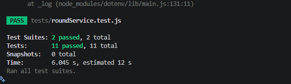

However, given I have yet to create a seperate test Database, running these tests at present wipes the current live Database. This is an issue that will need to be resolved in the near future. But as tests are currently passing, in order to keep up with the Schedule after losing time to make these changes, I have left this as it for now.

## Updated Postman tests

I ran a few Postman tests on Local Server in order to check the new database functions were working correctly. I was able to Search by region, Search by course name, POST a new round, and PUT changes relative to that round.

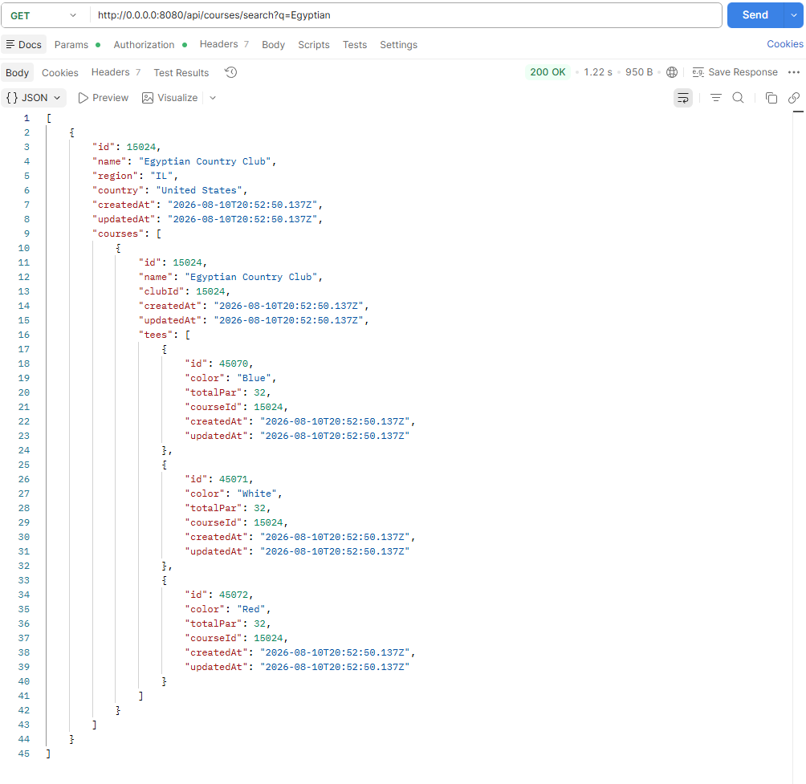

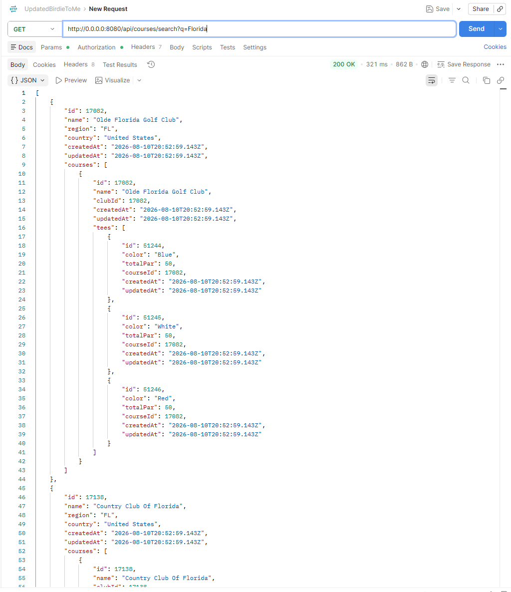

A new postman collection has also been added to reflect this.

---
